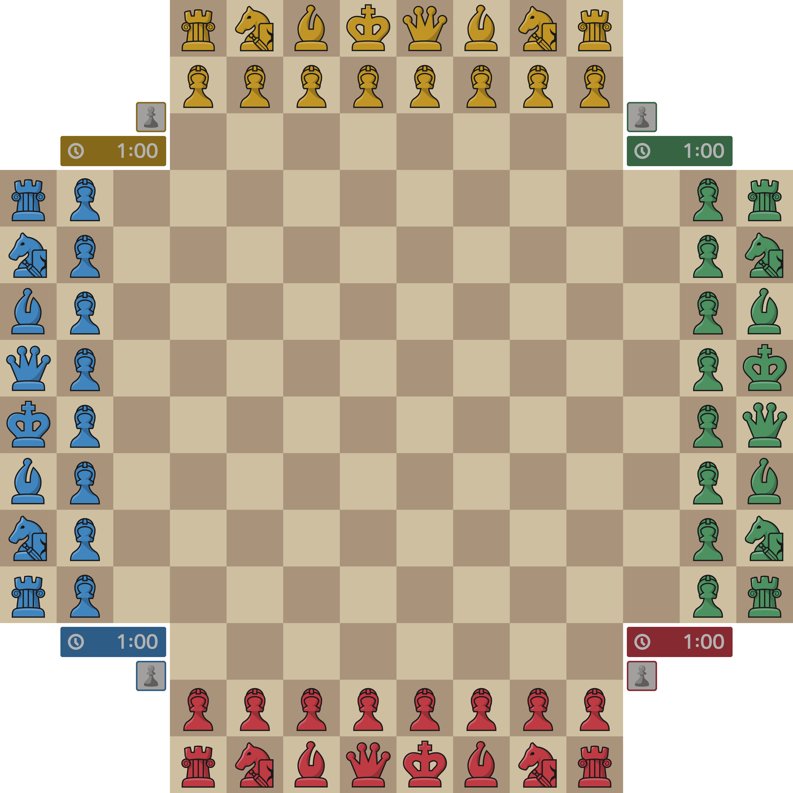

  

  <h3>Talia</h3>

  An open-source UCI-compatible chess engine for 2 and 4 player chess.

## Table of Contents
*coming soon ...*

## Overview
*coming soon ...*

## Getting Started
*coming soon ...*

## Contribute
*coming soon ...*