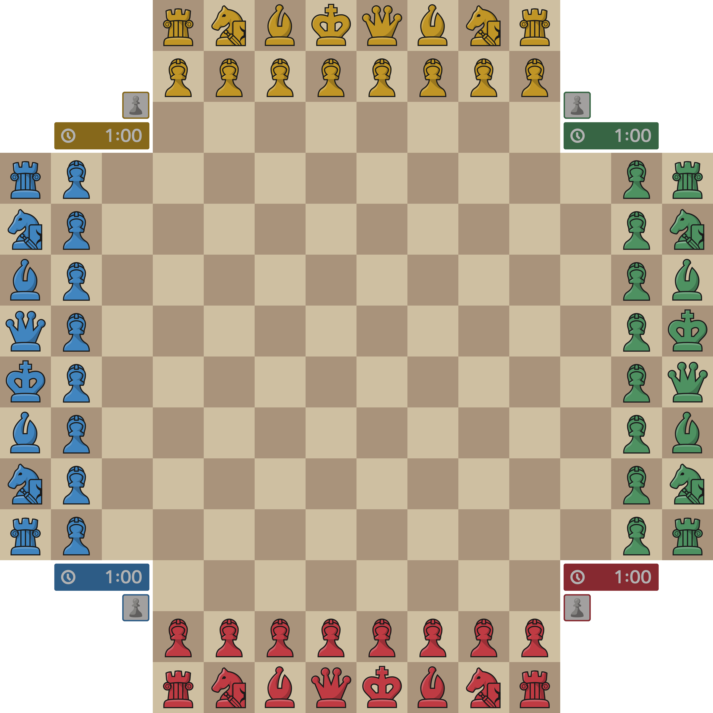

<div align="center">

  

  <h3>Athena</h3>

  A UCI-compatible four-player chess engine powered by deep RL and 256-bit bitboards.

</div>
<div align="center">

</div>

## Table of Contents
- [Installation](#installation)
- [4PC engines and tools](#4pc-engines--tools)
  - engines
  - tools
- [licenses](#licenses)


## Installation
Clone the repository

```bash
git clone https://github.com/arianahejazyan/Athena.git && cd Athena/athena 
```
Create a build directory and compile
```bash
cmake -S . -B build -DCMAKE_BUILD_TYPE=Release && cmake --build build
```
Once built, you can run the Athena cli
```bash
cd build && ./athena
```

## 4PC Engines
<p align="justify"> 
This is a list of four-player chess engines to help discover and support other engines. Feel free to add your chess engine here, or ask me to add it for you. You can include your Chess.com profile and GitHub repository. </p>
 
<table align="center">
  <tr>
    <td>Athena (<a href="https://github.com/arianahejazyan/Athena" target="_blank">GitHub</a>, <a href="https://www.chess.com/member/teamathena1" target="_blank">Chess.com</a>)</td>
    <td>Samaritan (<a href="https://github.com/Moxile/Samaritan" target="_blank">GitHub</a>)</td>
  </tr>
</table>


You can also find four-player chess tools list in this [repo](https://github.com/arianahejazyan/Colosseum).