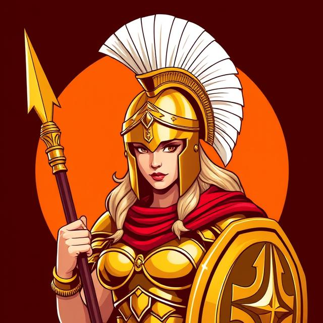

<div align="center">

  

  <h3>Athena</h3>

  A UCI-compatible four-player chess engine

</div>
<div align="center">

</div>

## Table of Contents
*coming soon*
## Introduction
*coming soon*
## Getting Started
### 1. Clone the repository
```bash
git clone https://github.com/arianahejazyan/Athena.git
cd Athena
```
### 2. Build the project
**Linux / WSL / macOS:**
```bash
cmake -S . -B build -DCMAKE_BUILD_TYPE=Release
cmake --build build
```
**Windows:**
```bash
cmake -S . -B build -DCMAKE_BUILD_TYPE=Release
cmake --build build --config Release
```
### 3. Run Athena CLI
After successful build, you can run the engine:

**Linux / WSL / macOS:**
```bash
./build/athena
```
**Windows:**
```bash
.\build\Release\athena.exe
```

> See [manual](./docs/manual.md) for the full list of commands and options.

## Features
### Chess
*coming soon*
### Search
*coming soon*
### Evaluate
*coming soon*
## 4PC Engines
<p align="justify"> 
This is a list of four-player chess engines to help discover and support other engines. Feel free to add your chess engine here, or ask me to add it for you. You can include your Chess.com profile and GitHub repository. </p>
 
<table align="center">
  <thead>
    <tr>
      <th>Engine</th>
      <th>GitHub</th>
      <th>Chess.com</th>
    </tr>
  </thead>
  <tbody>
    <tr>
      <td>Athena</td>
      <td><a href="https://github.com/arianahejazyan/Athena" target="_blank">arianahejazyan/Athena</a></td>
      <td><a href="https://www.chess.com/member/teamathena1" target="_blank">TeamAthena</a></td>
    </tr>
    <tr>
      <td>Samaritan</td>
      <td><a href="https://github.com/Moxile/Samaritan" target="_blank">Moxile/Samaritan</a></td>
      <td>—</td>
    </tr>
    <tr>
      <td>Enigma</td>
      <td><a href="https://github.com/anurag-baundwal/4pchess" target="_blank">anurag-baundwal/4pchess</a></td>
      <td><a href="https://www.chess.com/member/teamenigma1" target="_blank">TeamEnigma</a></td>
    </tr>
    <tr>
      <td>Nexus</td>
      <td>(private)</td>
      <td><a href="https://www.chess.com/member/TeamNexus1" target="_blank">TeamNexus</a></td>
    </tr>
    <tr>
      <td>BlackKnight</td>
      <td>(private)</td>
      <td><a href="https://www.chess.com/member/TeamBlackKnight1" target="_blank">TeamBlackKnight</a></td>
    </tr>
    <tr>
      <td>Titan</td>
      <td><a href="https://github.com/obryanlouis/4pchess" target="_blank">obryanlouis/4pchess</a></td>
      <td><a href="https://www.chess.com/member/teamtitan1" target="_blank">TeamTitan</a></td>
    </tr>
    <tr>
      <td>Terminator</td>
      <td>(private)</td>
      <td><a href="https://www.chess.com/member/teamterminator1" target="_blank">TeamTerminator</a></td>
    </tr>
  </tbody>
</table>

You can also find four-player chess tools list in this [repo](https://github.com/arianahejazyan/Colosseum).

## Acknowledgements
- **Special thanks** to Moxile for always supporting me and for the many hours of programming together.
- **Special thanks** to tsoj, Lotfy and the Discord chess engine community for their help with coding and discussions.
- **Special thanks** to qilp and Chess.com team for providing API access and support.
- **Special thanks** to all contributors for their support and contributions.